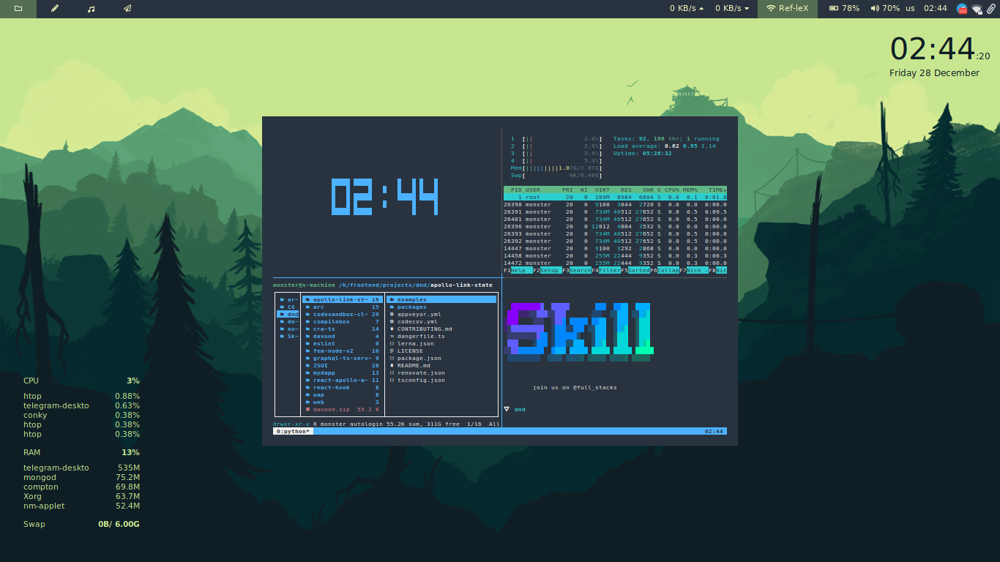

# S-Kill dotfiles

[Arch GNU/Linux](https://www.archlinux.org/)+[i3wm](https://i3wm.org/) bootstrap and rice dotfiles/scripts.

## Basic Usage (Lazy Line)

install.sh script will install and config all scripts inside `./install` directory. [What is inside?](https://github.com/frontendmonster/dotfiles#whats-inside-install)

`$ git clone git@github.com:frontendmonster/dotfiles.git && cd dotfiles && source /install.sh`

---

## Whats inside ./install

There are scripts inside ./install directory to bootstrap a clean arch OS.
you can run scripts manually too.
here is a list of scripts:

| script            | description                                                                                                                                                   |
| ----------------- | ------------------------------------------------------------------------------------------------------------------------------------------------------------- |
| `config.sh`:      | preconfigure OS (etc., timezone)                                                                                                                              |
| `pacman.sh`:      | update mirrors install required arch packages.                                                                                                           |
| `aurman.sh`:      | install [aurman](https://github.com/polygamma/aurman/) and install required aur packages.                                                                |
| `zsh.sh`:         | install and make default [zsh](https://zsh.org/), install and configure [oh-my-zsh](https://ohmyz.sh/).                                                  |
| `node.sh`:        | install [nvm](https://github.com/creationix/nvm/) and node with latest npm and some useful global npm package.                                           |
| `mongo.sh`:       | start [mongodb](http://mongodb.org) service.                                                                                                             |
| `noevim.sh`:      | install [neovim](https://neovim.io/) python packages.                                                                                                    |
| `gaming.sh`:      | install [steam](https://steampowered.org/) and nvidia xrun.                                                                                              |
| `fonts.sh`:       | install some useful and popular fonts.                                                                                                                   |
| `fix-watcher.sh`: | increase max number of system watchers for development purpose [issue](https://github.com/facebook/jest/issues/3254/)                                    |
| `dotfiles.sh`:    | copy all configs and rcfiles into your `$HOME` directory (backup your dotfiles).                                                                         |
| `git.sh`:         | setup [git](https://git-scm.com/).                                                                                                                       |
| `npm.sh`:         | setup [npm](https://npmjs.com/) and [yarn](https://yarnpkg.com/).                                                                                        |
| `vscode.sh`:      | install [sync-setting](https://marketplace.visualstudio.com/items?itemName=Shan.code-settings-sync/) [vscode](https://code.visualstudio.com/) extension. |
| `ssh.sh`:         | generate ssh rsa key and copy to clipboard.                                                                                                              |

## Feedback

Suggestions and improvements are [welcomed](https://github.com/frontendmonster/dotfiles/issues/)!

## Related

* [oh-my-zsh-skill-theme](https://github.com/frontendmonster/oh-my-zsh-skill-theme/)
* [vscode-skill-theme](https://github.com/frontendmonster/vscode-skill-theme/)
